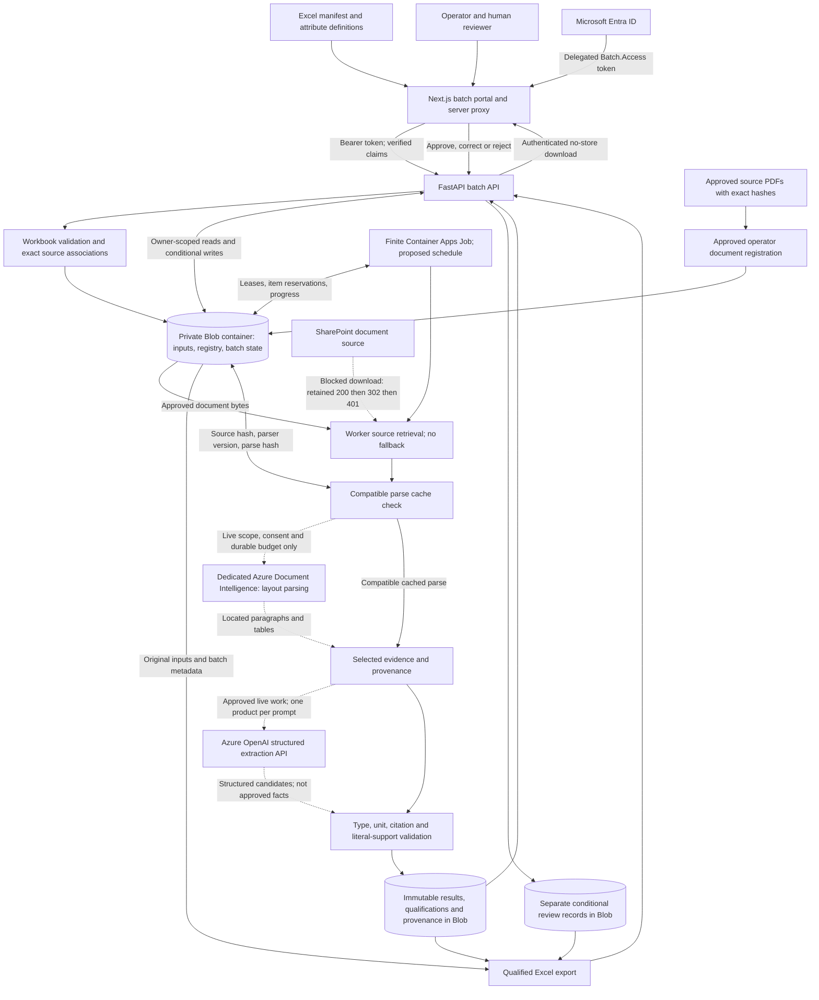
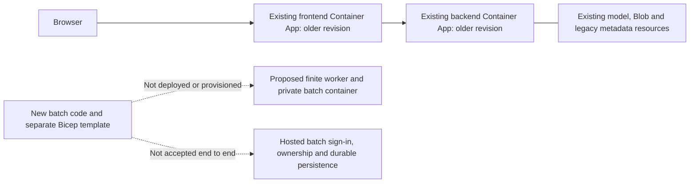

# Architecture And Activation Boundaries

[README](../README.md) | [User guide](USER_GUIDE.md) | [Deployment](../DEPLOYMENT.md)

This is an original description of DocIntel's code and infrastructure, not a copy
of another accelerator's design. The target wiring below is implemented in source
unless marked blocked or conditional; **it is not evidence of Azure activation**.
Solid arrows describe implemented paths, dotted arrows conditional or blocked
paths. Document Intelligence, model serving, identity, compute, and storage are
separate services, even when model resources are managed through Foundry.

## Target Hosted Batch Architecture

The Blob shapes are logical records in one dedicated private container, not three
databases. The worker and backend use managed identity; the new job's proposed
container-scoped Blob grant and registry pull grant do not confer AI permission.
The template leaves live execution disabled and does not provision DI or model
access. Entra app registration/consent and hosted acceptance remain external gates.

`evidence_only` does not call either AI service and supplies no generated candidates.
The SharePoint branch deliberately records the retained failure without making a
fresh request or claiming bytes/hash. It is **not an active Graph downloader**.
Private Blob retrieval and strict parse reuse are implemented; arbitrary URL fetch,
portal PDF upload, automatic web fallback, and general live-catalog approval are not.

## Last Observed Azure State

The earlier read-only inspection found both Container Apps healthy with traffic on
older ready revisions, no job in the inspected resource group, and no established
platform authentication enforcement. Resource health and pre-existing backend roles
do not verify the new batch paths. No fresh Azure query or activation was performed
for this documentation work; see the [dated evidence](../BATCH.md#existing-azure-state-read-only).

## Code And Infrastructure Map

| Boundary | Owning implementation and limits |
| --- | --- |
| Excel intake and export | [workbooks.py](../backend/workbooks.py), [batch.py](../backend/batch.py): bounded OOXML, explicit mappings, retained input hashes and original rows. |
| Portal and drill-down | [queue](../frontend/app/batches/page.tsx), [item](../frontend/app/batches/%5BbatchId%5D/%5BitemKey%5D/page.tsx), [review component](../frontend/components/enrichment-review.tsx). |
| Hosted auth | [auth.ts](../frontend/auth.ts), [server proxy](../frontend/app/api/batches/%5B%5B...path%5D%5D/route.ts), [token validation](../backend/batch_auth.py): fixed portal origin, RS256, issuer/audience/tenant/client/scope/expiry/object ID. |
| Durable state | [batch_store.py](../backend/batch_store.py): private Blob, ETags and leases; explicit development SQLite alternative. No automatic container creation or hosted local-disk fallback. |
| Worker and source handling | [batch_worker.py](../backend/batch_worker.py): finite slices, reservations, parse cache, strict live scope and budgets. No whole-catalog model prompt. |
| Parsing and inference | [docintel.py](../backend/core/docintel.py), [llm.py](../backend/core/llm.py), [extract.py](../backend/extract.py): located evidence, structured API calls, validation and separate reviews. No agent service. |
| API mounting | [batch_api.py](../backend/batch_api.py), [main.py](../backend/main.py): batch router at `/api/v1/batches`; separate development entry point. |
| Azure image mapping | [azure.yaml](../azure.yaml), [backend image](../backend/Dockerfile), [frontend image](../frontend/Dockerfile). |
| Proposed worker resources | [batch.bicep](../infra/batch.bicep), [job module](../infra/modules/containerAppJob.bicep): separate approval-only deployment; five-minute schedule, finite command, 600-second timeout, zero replica retries. |
| Inherited infrastructure | [main.bicep](../infra/main.bicep): broader template resources, including legacy media/metadata paths. Not the batch activation shortcut. |

## Trust, Failure, And Scale

Tokens remain in the encrypted HttpOnly auth cookie/server proxy, not public session
JSON. The batch API verifies claims and uploader ownership independently. Local
headers and the pilot's browser controls are not hosted authentication. Legacy API
routes still require their own security review.

Immutable proposals and separate human reviews allow export without rewriting
machine evidence. Qualification notes remain notes, not source excerpts. Exact
source identity/hash checks, reservations and conservative budgets limit accidental
reprocessing; unknown remote completion is surfaced as an interruption, not retried.

Batch controls support the intended catalog workflow, but current evidence is
small synthetic and bounded product testing, not catalog-scale throughput or
accuracy measurement. Blob history/filter scans, scheduler overlap, retention,
backup, cost alerts, private networking, and failure recovery need hosted validation.

## Not Active In This Workflow

Copilot Studio, Azure AI Search, vendor-table enrichment, and WebIQ fallback are
not active batch components. A standalone WebIQ diagnostic establishes only its
reported connectivity/response shape, not integration or source correctness.
Cosmos and media-generation code belong to inherited surfaces, not batch persistence.
Future search/retrieval adapters, team sharing, indexed queues, wider live scope,
and catalog benchmarking require separate design, permissions, tests, and approval.